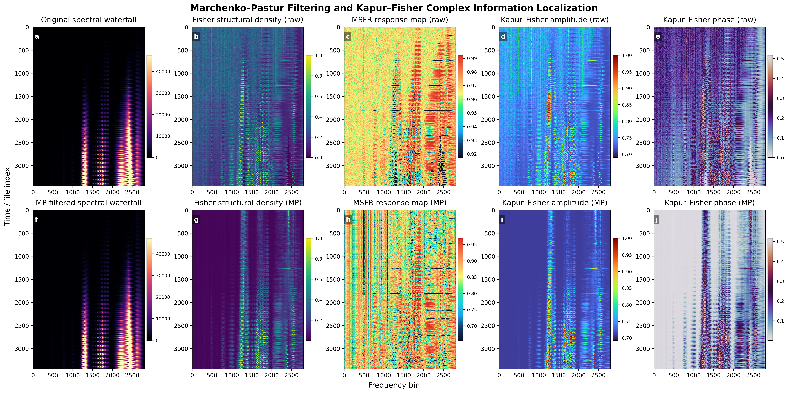
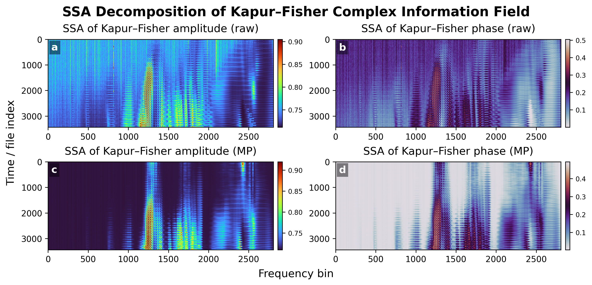
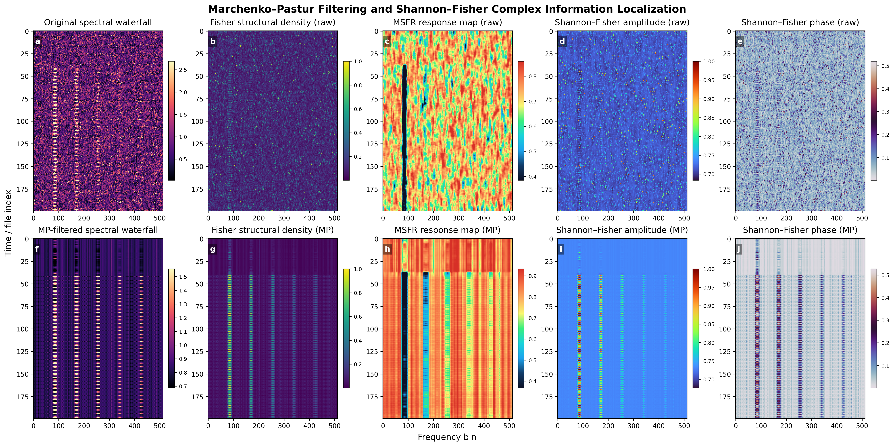
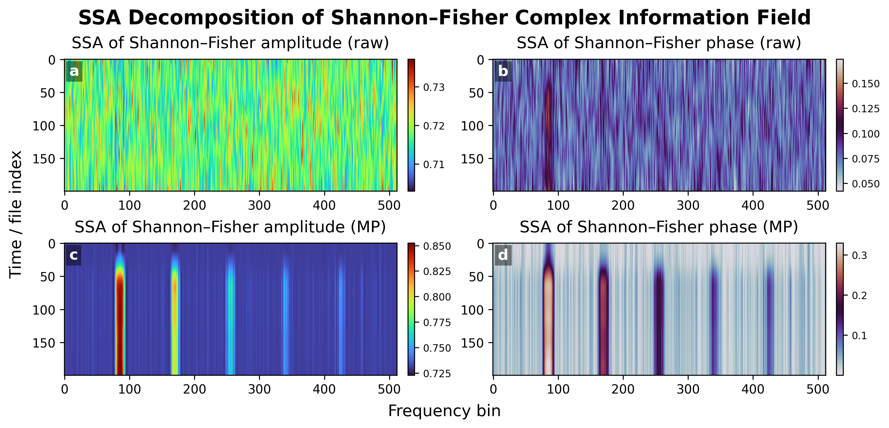

# Z-Complex Spectral Localization

This project provides a Python-based signal analysis pipeline for structural recovery and localization in high-entropy spectral waterfall data. The framework combines Marchenko–Pastur filtering, Singular Spectrum Analysis (SSA), Z-complex reconstruction, Fisher-inspired localization, and Modified Shannon–Fisher Ratio (MSFR) mapping.

## Poster Presentation

The repository also includes a poster presentation summarizing the Z-Complex reconstruction framework, the MP–SSA recovery pipeline, and the Shannon–Fisher localization methodology.


## What the project does

The pipeline processes spectral waterfall data stored as HDF5 files and generates a compact 2×3 reconstruction figure containing:


 

1. the original spectral waterfall,
2. the MP-filtered spectral backbone,
3. the SSA-recovered residual structure,
4. the reconstructed Z-complex amplitude,
5. the Fisher-inspired localization map,
6. the MSFR response map.

The goal is to reveal weak coherent spectral structures that may remain hidden inside high-entropy or noisy spectral observations.

## Core Concept

The framework transforms noisy spectral waterfalls into an information-structured representation where:
entropy acts as an information-density descriptor,
Fisher information acts as a structural transition detector,
and complex-domain reconstruction reveals latent coherent dynamics hidden inside stochastic observations.

The central reconstruction is based on the Z-complex representation:
\[
Z(t,f) = A_{MP}(t,f) + iA_{SSA}(t,f)
\]

## Experimental vs Synthetic Spectral Waterfalls

### Experimental spectral waterfall
Real spectroscopic waterfall obtained during picosecond laser–matter interaction experiments on crystalline material structures.




### Synthetic spectral waterfall
Synthetic high-entropy spectral waterfall generated using the included simulator.




The current generator is intended only as a signal-level simulator for testing the reconstruction pipeline. Although it reproduces several statistical and structural properties of spectral waterfall data, it does not yet model the physical dynamics of laser-stimulated emission, plasma evolution, or crystal-lattice interaction processes.

## Input file format

The project expects spectral data in HDF5 format (`.h5`). Each HDF5 file contains one spectral measurement stored at the dataset path:

```text
entry/instrument/spectrometer/data/signal

